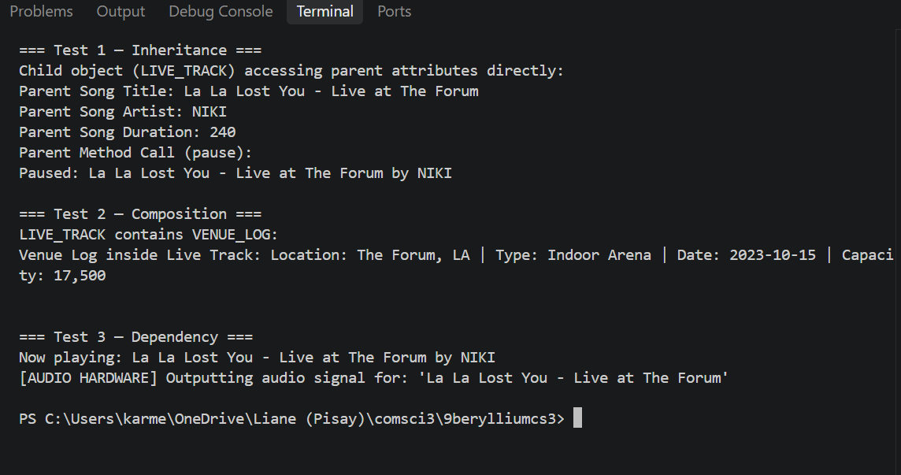

# Advanced Class Relationships

## Previous Activities

[classAttrib](https://github.com/klaoblina-byte/9berylliumcs3/blob/main/q1/classAttributesMethods.md)
[classRel](https://github.com/klaoblina-byte/9berylliumcs3/blob/main/q1/OOPAct_III.md)

## Existing System Description:

### What classes currently exist in your system?

Class 1: SONGS

Class 2: ALBUM

###  What problem or limitation exists in your current design?

A constraint in my existing design is unclear ownership between the ALBUM and SONGS classes. The ALBUM class contains the song objects, while the SONGS class is unaware of which album it belongs to. This can make it unclear regarding whether a song can be part of multiple albums or just a single album. The ALBUM class currently exclusively manages the relationship through its list of songs.

## Inheritance Relationship

Parent: SONGS
Child: LIVE_TRACK
Explanation: A LIVE_TRACK IS-A SONGS item because it carries a title, duration, artist, and play history. It specializes the parent class by storing concert-specific data like concert  venue, recording date, and crowd noise level.

## Inheritance UML
[Inheritance](https://github.com/klaoblina-byte/9berylliumcs3/blob/main/q1/images/inheritanceDiagram.png)

## Composition/Aggregation
Relationship:
Explanation:

## Advanced UML Diagram

## Python Implementation
[Source Code](advancedRelationships.py)

## Test Run

## Object Diagram

## Reflection
Answers: