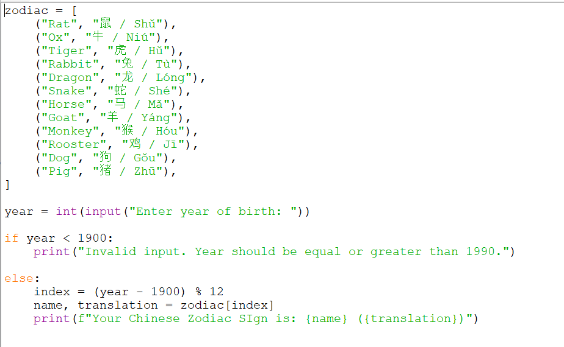
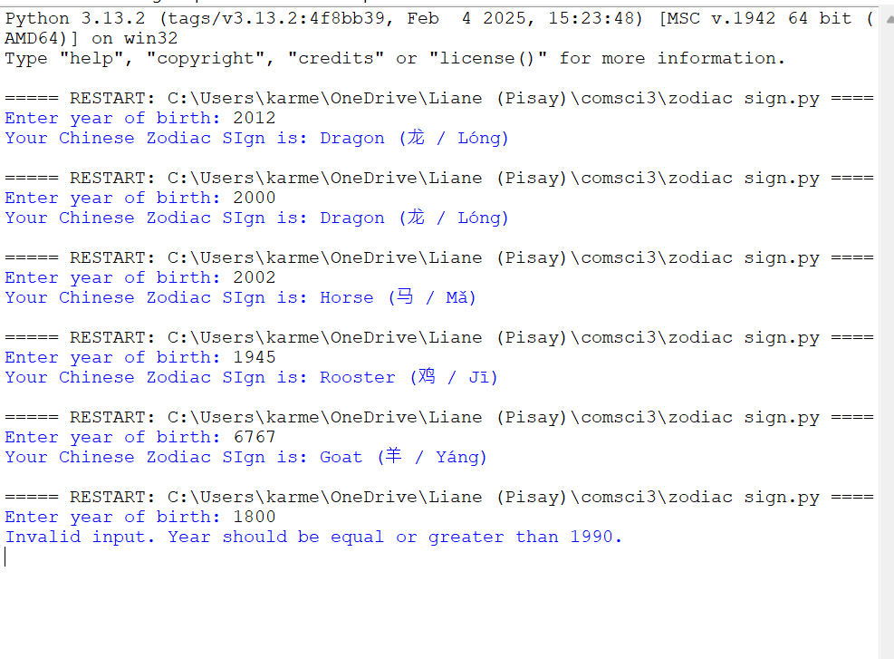

zodiac = [
    ("Rat", "鼠 / Shǔ"),      
    ("Ox", "牛 / Niú"),           
    ("Tiger", "虎 / Hǔ"),         
    ("Rabbit", "兔 / Tù"),        
    ("Dragon", "龙 / Lóng"),      
    ("Snake", "蛇 / Shé"),       
    ("Horse", "马 / Mǎ"),
    ("Goat", "羊 / Yáng"),
    ("Monkey", "猴 / Hóu"), 
    ("Rooster", "鸡 / Jī"), 
    ("Dog", "狗 / Gǒu"), 
    ("Pig", "猪 / Zhū"),
    ]

year = int(input("Enter year of birth: "))

if year < 1900:
    print("Invalid input. Year should be equal or greater than 1900.")

else:
    index = (year - 1900) % 12
    name, translation = zodiac[index]
    print(f"Your Chinese Zodiac Sign is: {name} ({translation})")